# Candidate Projects

Nineteen options, grouped by industry. They're deliberately spread across **different
kinds of engineering** and **different sectors**, not variations on one theme — because
the point of Phase 1 is to find out which kind you actually like doing, and which
industry you'd want to work in.

Don't pick from this document. Read it, do the [taste-test](TASTE_TEST.md), then pick.
Descriptions are a bad predictor of what's enjoyable to debug at week five.

**Navigate by industry first.** Find a sector that interests you, read the two or three
entries under it properly, and skim the rest. Reading all nineteen carefully is a good
way to end up unable to choose.

---

## How to read these

- **The question** — what the project answers. If a project has no question, it's a demo.
- **What you'd own** — the decisions that are yours. What an interviewer will ask about.
- **Data + licence** — verified where possible, flagged where not.
- **Compute** — against a local NVIDIA GPU plus a cloud budget.
- **Hardest unknown** — the thing most likely to eat a week.

### A note on licensing, because it matters more than it sounds

Several obvious "default" datasets are **non-commercial research-use only**
(CC BY-NC-SA). Fine for a portfolio piece and a public repo. *Not* fine if Axonity ever
puts the result in front of a client. Where the obvious dataset is restricted, a
commercially-usable alternative is named. **Decide which track you're on in week one** —
retrofitting a dataset in week six is miserable.

---

## The landscape

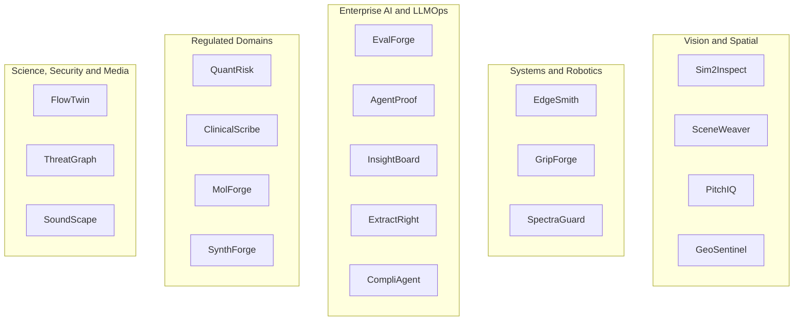

---

## Summary

| Project | Industry | Core stack | Compute |
|---|---|---|---|
| Sim2Inspect | Manufacturing / industrial QA | PyTorch, Anomalib, OpenCV, FastAPI | Low-med |
| SceneWeaver | Spatial computing, AR/VR, robotics | COLMAP, gsplat, Open3D, Three.js | Med-high |
| EdgeSmith | ML infrastructure / Edge AI | PyTorch, ONNX Runtime, TensorRT | Low |
| GripForge | Robotics, warehouse automation | MuJoCo / Isaac Lab, SB3, Gymnasium | Med |
| PitchIQ | Sports analytics, broadcast media | YOLO, ByteTrack, OpenCV | Med |
| SoundScape | Media production, film and games | torchaudio, librosa, Web Audio | Med |
| ThreatGraph | Cybersecurity, enterprise SOC | PyTorch Geometric, DuckDB, NetworkX | Low |
| SpectraGuard | Telecom, defence, spectrum | GNU Radio, SciPy, PyTorch | Low |
| GeoSentinel | Insurance, disaster response, GeoAI | rasterio, TorchGeo, MapLibre | Med |
| FlowTwin | Industrial engineering, digital twins | neuraloperator, OpenFOAM, PyVista | Med |
| EvalForge | Enterprise AI / LLMOps | Anthropic + OpenAI SDKs, pytest, SciPy | Low |
| AgentProof | Enterprise AI, agent platforms | LangGraph, OpenTelemetry, Postgres | Low |
| InsightBoard | Business intelligence, analytics | DuckDB, Vega-Lite, tool-calling | Low |
| ExtractRight | Financial services, insurance, legal | LayoutLMv3 / Donut, Pydantic, docTR | Low-med |
| QuantRisk | Finance, risk management | PyTorch, statsmodels, Polars | Low |
| CompliAgent | RegTech, compliance | LangGraph, pgvector, Pydantic | Low |
| MolForge | Biotech, pharma | PyTorch Geometric, RDKit, DeepChem | Low-med |
| ClinicalScribe | Healthcare, clinical NLP | Transformers, medspaCy, Presidio | Med |
| SynthForge | Privacy engineering, regulated data | SDV, Opacus, PyTorch | Low-med |

---

# Industrial & Manufacturing

## Sim2Inspect — industrial defect inspection

**Industry:** Manufacturing / industrial quality assurance
**Work mode:** 2D vision + experimental design
**Stack:** PyTorch, timm, Anomalib, OpenCV, Albumentations, FastAPI, Docker, MLflow

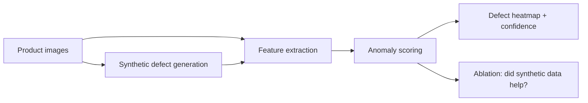

**The question:** does synthetic training data actually improve real-world defect
detection, and by how much? **The answer might be no** — a rigorously measured negative
result is a better interview story than a demo that works for unclear reasons.

**What you'd own:** anomaly detection vs. supervised segmentation vs. embedding-kNN as
the formulation; how realistic synthetic defects need to be before they help; what metric
to use when false positives are expensive (AUROC alone is not enough); how thresholds
shift across product types and lighting.

**Data + licence:** **VisA** — CC BY 4.0, commercial use permitted. ⚠️ **Avoid MVTec AD**
as your primary dataset: CC BY-NC-SA 4.0, non-commercial only.

**Compute:** low-medium. Frozen features + kNN needs almost no training, so iteration is
fast. **Hardest unknown:** whether your synthetic defects transfer at all.

---

# Spatial & 3D

## SceneWeaver — video to explorable 3D scene

**Industry:** Spatial computing, AR/VR, robotics
**Work mode:** 3D geometry + semantic fusion
**Stack:** COLMAP, gsplat / Nerfstudio, PyTorch, Open3D, SAM, Three.js, FastAPI

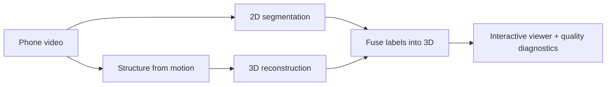

**The question:** how do you fuse 2D semantic understanding into a 3D reconstruction
consistently, and how do you know when the reconstruction is bad?

**What you'd own:** classical structure-from-motion vs. learned pose/depth, and where each
fails; how 2D masks fuse into 3D without contradicting each other across views; how view
count, blur and baseline affect quality; whether V1 is a splat, point cloud or mesh.

**Data + licence:** your own captures, so no dataset restriction. ⚠️ **Tooling licence is
the trap:** the reference 3D Gaussian Splatting implementation from Inria is
**research/non-commercial only**. Use **gsplat / Nerfstudio (Apache 2.0)**. COLMAP is BSD.

**Compute:** medium-high — the most GPU-hungry option. **Hardest unknown:** reconstruction
quality on real handheld video, which is much worse than paper figures suggest.

---

# ML Infrastructure & Edge AI

## EdgeSmith — deployment optimizer

**Industry:** ML infrastructure / MLOps, edge AI
**Work mode:** Systems, profiling, measurement
**Stack:** PyTorch, ONNX Runtime, TensorRT, torch.profiler, Docker, pytest-benchmark

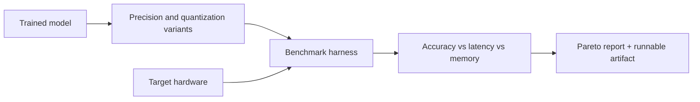

**The question:** for a given model and target hardware, what's the actual
accuracy/latency/memory frontier, and which optimisations are safe?

**What you'd own:** which optimisations are safe for a given architecture; how to
benchmark fairly (warmup, batching, thread count, variance); where the acceptable
accuracy-loss boundary sits; when quantisation calibration data is misleading.

**Data + licence:** standard vision models and validation sets — permissive.

**Compute:** low, mostly inference. **Hardest unknown:** measurement noise. Benchmarking
honestly is much harder than it looks, and this project lives or dies on it.

**Note:** most directly attacks testing, Docker and deployment — your three lowest
self-ratings. Also the least "read a paper" of the list, which cuts against what you said
motivates you.

---

# Robotics

## GripForge — robot arm learns to pick things up

**Industry:** Robotics, warehouse automation
**Work mode:** Reinforcement learning, reward design
**Stack:** MuJoCo or Isaac Lab, Gymnasium, Stable-Baselines3, PyTorch, Weights & Biases

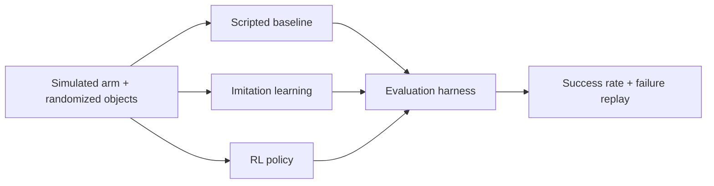

**The question:** what does the reward function actually incentivise, as opposed to what
you intended it to incentivise?

**What you'd own:** reward design; state vs. vision observations and the cost of partial
observability; when imitation should bootstrap RL; how much domain randomisation helps
before training destabilises.

**Data + licence:** MuJoCo (Apache 2.0) or Isaac Lab (BSD-3). Clean.

**Compute:** medium, but long wall-clock — RL runs are measured in hours.
**Hardest unknown:** RL debugging has genuinely unbounded time variance. When it doesn't
learn, the cause could be the reward, the observation space, the hyperparameters or a
bug, and telling those apart is the skill.

---

# Media & Sports

## PitchIQ — soccer footage to tactical data

**Industry:** Sports analytics, broadcast media
**Work mode:** Video, tracking, geometry
**Stack:** Ultralytics YOLO, ByteTrack, OpenCV, PyTorch, FastAPI

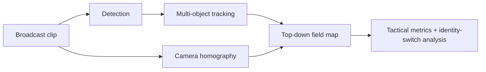

**The question:** how do you track identities reliably through occlusion, and how do you
measure that honestly rather than by picking nice clips?

**What you'd own:** detector/tracker association trade-offs during occlusion; robust
homography estimation from moving broadcast cameras; which tactical metrics are stable
enough to actually claim; evaluating identity switches instead of cherry-picking.

**Data + licence:** **SoccerNet** — free for research and education with attribution.
⚠️ Commercial use requires prior written permission.

**Compute:** medium. **Hardest unknown:** homography from moving broadcast cameras.

## SoundScape — silent video to spatial audio

**Industry:** Media production, film and games
**Work mode:** Multimodal, audio-visual synchronisation
**Stack:** PyTorch, torchaudio, librosa, OpenCV, object tracking, Web Audio API

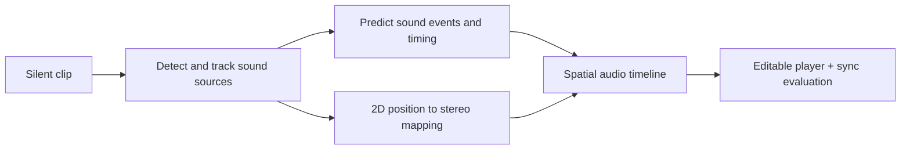

**The question:** what visual motion cues predict sound timing, and how do you evaluate
audio-visual synchronisation objectively?

**What you'd own:** generate audio vs. retrieve from a licensed library; which motion cues
predict onset timing; mapping 2D position and a depth proxy into stereo space; evaluating
synchronisation without relying on "sounds right to me."

**Data + licence:** ⚠️ **Verify during the spike.** Audio-visual datasets are frequently
YouTube-derived, which brings redistribution restrictions. The least-settled licensing
position on this list.

**Compute:** medium. **Hardest unknown:** evaluation — "does this sound right" is hard to
turn into a number.

---

# Security

## ThreatGraph — lateral movement detection

**Industry:** Cybersecurity, enterprise SOC
**Work mode:** Graph ML, anomaly detection, leakage-safe evaluation
**Stack:** PyTorch Geometric, NetworkX, Polars / DuckDB, scikit-learn, FastAPI, Cytoscape.js

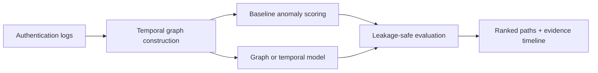

**The question:** how do you rank suspicious activity when labels are almost nonexistent,
without leaking future information into the model?

**What you'd own:** building the graph without temporal leakage (the central trap, and
subtle); which baseline catches real anomalies without drowning an analyst in alerts;
ranking with sparse labels; what counts as evidence versus post-hoc storytelling.

**Data + licence:** **LANL authentication dataset** — public domain waiver. Cleanest
licensing here, and it includes labelled red-team activity, so you have ground truth.

**Compute:** low, CPU-friendly. **Hardest unknown:** temporal leakage — it's easy to build
a model that looks excellent and is silently cheating.

**Scope guardrail:** defensive detection only. No exploit or attack tooling.

---

# Telecom & Signals

## SpectraGuard — RF signal classification

**Industry:** Telecom, defence, spectrum management
**Work mode:** Signal processing, robustness analysis
**Stack:** GNU Radio, NumPy / SciPy, PyTorch, WebSockets

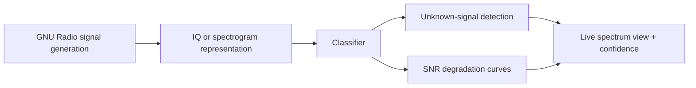

**The question:** how does a signal classifier degrade as signal-to-noise worsens, and can
it recognise a signal type it was never trained on?

**What you'd own:** raw IQ vs. spectrogram representation; stopping synthetic channel
artifacts from becoming shortcuts the model exploits; randomising SNR, frequency offset
and fading; detecting unknown signals rather than forcing everything into a known class.

**Data + licence:** ⚠️ **RadioML is CC BY-NC-SA — non-commercial.** Generate your own with
**GNU Radio** instead; generated data is yours, and generating it is part of the learning.

**Compute:** low. **Hardest unknown:** making synthetic channel effects realistic enough
that the model learns signal structure rather than your simulator's fingerprints.

**Scope guardrail:** classification and anomaly awareness only. No jamming or operational
RF tooling.

---

# Geospatial

## GeoSentinel — satellite change detection

**Industry:** Insurance, disaster response, government GeoAI
**Work mode:** Geospatial vision, registration, uncertainty
**Stack:** rasterio, GDAL, TorchGeo, segmentation-models-pytorch, MapLibre, FastAPI

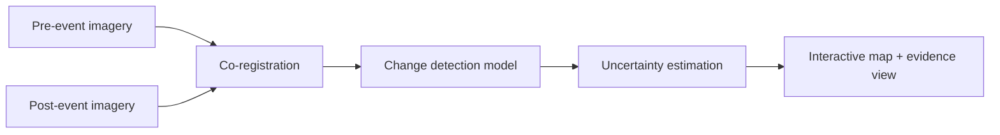

**The question:** how do you distinguish real change from misregistration, seasonal
variation and sensor differences?

**What you'd own:** pixel differencing vs. learned semantic change detection; aligning
imagery across sensors and dates; handling severe class imbalance and noisy labels;
communicating uncertainty without implying a map is certain.

**Data + licence:** **SpaceNet** (CC BY-SA 4.0, commercial permitted with share-alike) or
**Sentinel-2** via Copernicus (open). ⚠️ **Avoid xBD** as the spine — CC BY-NC-SA.

**Compute:** medium; data volume is the real cost. **Hardest unknown:** registration — two
images of the same place are never quite the same place.

---

# Scientific & Engineering ML

## FlowTwin — physics surrogate model

**Industry:** Industrial engineering, digital twins, CAE
**Work mode:** Scientific ML, uncertainty quantification
**Stack:** PyTorch, neuraloperator (FNO), OpenFOAM or SU2, xarray, PyVista

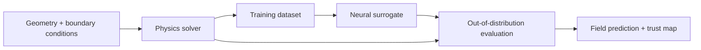

**The question:** where does a fast learned approximation of a slow physics solver stop
being trustworthy?

**What you'd own:** operator model vs. convolutional surrogate vs. physics-informed
network; what normalisation preserves physical meaning; splitting the parameter space so
the test set is genuinely out-of-distribution; communicating uncertainty where the
surrogate is unsafe to trust.

**Data + licence:** you generate it from an open solver. Solvers are GPL/LGPL, which
affects distribution of modified solver code but not your generated data.

**Compute:** medium, plus meaningful CPU time generating data. **Hardest unknown:** the
physics ramp-up — the biggest domain-knowledge investment here.

---

# Enterprise AI & LLMOps

## EvalForge — LLM evaluation and regression harness

**Industry:** Enterprise AI / LLMOps
**Work mode:** Measurement, statistics, evaluation design
**Stack:** Anthropic + OpenAI SDKs, pytest, promptfoo or Ragas, Postgres, SciPy, FastAPI + React

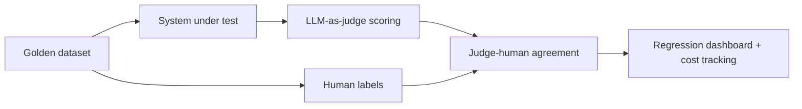

**The question:** did this change make the system better or worse, and how would you know?

Eval literacy is currently the single most-cited signal that someone has genuinely built
with LLMs — and roughly 95% of enterprise LLM pilots fail, with the diagnosed gap being
the missing infrastructure between "model approved" and "model monitored."

**What you'd own:** building a golden set that's representative rather than convenient;
measuring judge-human agreement and handling a confidently-wrong judge; separating a real
regression from noise; sample size for a claim to mean anything; what a single quality
score hides.

**Why an agent can't do it for you:** it will write an eval script instantly. It cannot
tell you your judge is biased toward verbose answers, or that your golden set is too small
to detect the regression you care about.

**Data + licence:** your own golden sets. `axonity_chatbot` is available as a real system
to evaluate if you want one — your call during the spike.

**Compute:** low; budget tokens, not GPU. **Hardest unknown:** getting a judge you can
trust, which is mostly a calibration problem rather than a prompting one.

## AgentProof — does multi-agent actually beat one good agent?

**Industry:** Enterprise AI, agent platforms
**Work mode:** Multi-agent orchestration, trajectory evaluation
**Stack:** LangGraph, Anthropic + OpenAI SDKs, OpenTelemetry tracing, Postgres, pytest

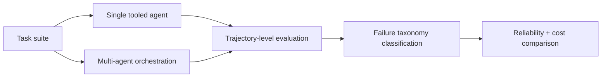

**The question:** on this task class, does multi-agent orchestration beat a single
well-tooled agent — and at what cost multiple?

The context: multi-agent systems fail at 41-86.7% in production. At 85% per-step
reliability, a 10-step workflow completes 19.7% of the time; at 20 steps, 3.9%. Only
11-14% of enterprise agent pilots reach production. The MAST taxonomy (NeurIPS 2025,
1,600+ traces) maps 14 failure modes to specification ambiguity, coordination breakdowns
and verification gaps.

**What you'd own:** task decomposition; how to evaluate a *trajectory* rather than a final
answer (genuinely unsolved — the intellectual core); where verification belongs; handling
mid-plan tool failure; when coordination overhead exceeds parallelism gains.

**Why it isn't a swarm demo:** the deliverable is the reliability analysis, not the agent.
The honest answer may be *"multi-agent lost, here's the evidence."*

**Compute:** low GPU, meaningful API spend — budget tokens explicitly.
**Hardest unknown:** trajectory evaluation. Nobody has fully solved it, which is what
makes it interesting and what makes scope discipline essential.

## InsightBoard — multimodal business intelligence

**Industry:** Business intelligence, analytics
**Work mode:** Text-to-SQL, multimodal retrieval, correctness verification
**Stack:** DuckDB or Postgres, tool-calling / LangGraph, Vega-Lite or Recharts, PyMuPDF, FastAPI + React

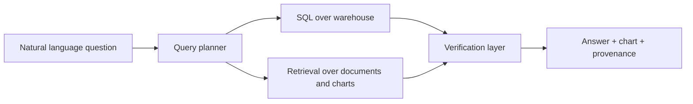

**The question:** when a natural-language analytics answer is wrong, how does anyone
notice?

**What you'd own:** how to verify generated SQL is *semantically* right and not just
runnable; when to refuse rather than guess; how to combine tabular results with evidence
from documents and charts; what provenance a business user needs to trust an answer.

**Data + licence:** public warehouse benchmarks (e.g. Spider-family text-to-SQL sets) —
**verify licence per dataset during the spike.**

**Compute:** low; token spend dominates. **Hardest unknown:** silent wrongness. A query
that runs and returns a plausible number is the dangerous failure mode.

---

# Document AI

## ExtractRight — document extraction with calibrated confidence

**Industry:** Financial services, insurance, legal operations
**Work mode:** Document understanding, calibration, human-in-the-loop
**Stack:** LayoutLMv3 or Donut, docTR / Tesseract, PyMuPDF, Pydantic, FastAPI, Label Studio

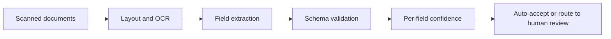

**The question:** when the extraction is wrong, does the system know?

Information extraction is the most-planned enterprise first deployment — roughly 20% of
organisations name it as their initial LLM use case, with document review close behind.

**What you'd own:** layout-aware models vs. pure LLM extraction; table handling, where
most approaches quietly break; calibrating confidence so the number means something;
per-field vs. per-document accuracy; where the human-review threshold sits when review
costs real money.

**Data + licence:** public form, invoice and receipt corpora — ⚠️ **verify per dataset
during the spike**; this family varies and several are PII-adjacent.

**Compute:** low-medium. **Hardest unknown:** calibration. Getting a confidence score that
actually correlates with correctness is much harder than producing one.

---

# Finance

## QuantRisk — risk and volatility modelling

**Industry:** Finance, risk management
**Work mode:** Time series, backtesting rigor
**Stack:** PyTorch, pandas / Polars, statsmodels, a backtesting library, Plotly or Recharts

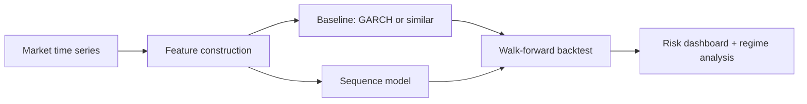

**The question:** does a learned model actually beat a classical volatility baseline once
you evaluate it honestly?

Finance is where naive evaluation fails most catastrophically, which is exactly what makes
it good practice. A model that looks profitable is usually leaking.

**What you'd own:** eliminating look-ahead bias (the trap that invalidates most amateur
work); walk-forward validation vs. random splits; how many strategies you tested before
finding one that worked, and what that does to your p-value; handling non-stationarity and
regime shifts; whether your baseline is strong enough to be a fair comparison.

**Data + licence:** ⚠️ **verify during the spike.** Free market-data sources vary widely
in redistribution terms — some prohibit republishing derived datasets. Establish this
before building anything on a given feed.

**Compute:** low. **Hardest unknown:** convincing yourself you haven't leaked. You almost
certainly have, at least once, and finding it is the skill.

## CompliAgent — regulatory compliance agent

**Industry:** RegTech, compliance
**Work mode:** Agentic retrieval, verifiable grounding, audit trails
**Stack:** LangGraph, pgvector, Anthropic + OpenAI SDKs, Pydantic, FastAPI, structured audit logging

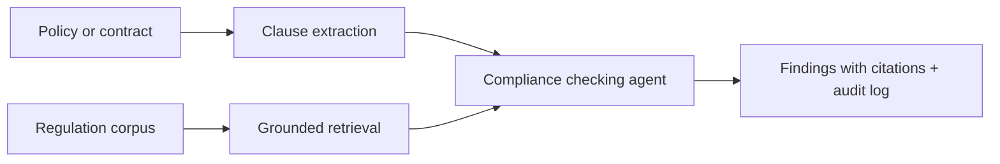

**The question:** how do you build an agent whose every claim is traceable to a source,
when the cost of one fabricated citation is losing all trust in the system?

**What you'd own:** enforcing grounding so citations are verifiable rather than plausible;
what the agent must refuse to answer; how to structure an audit trail that satisfies
someone reconstructing a decision months later; where a human reviewer is mandatory rather
than optional.

**Why compliance is a good forcing function:** in most LLM applications a hallucination is
embarrassing. Here it's disqualifying — which forces verification design that most
projects skip.

**Data + licence:** public regulatory corpora (EU regulations, SEC filings and similar are
generally open) — **confirm per source during the spike.**

**Compute:** low; token spend dominates. **Hardest unknown:** proving a citation actually
supports the claim, rather than merely existing and being topically related.

---

# Healthcare & Life Sciences

## MolForge — molecular property prediction

**Industry:** Biotech, pharma
**Work mode:** Graph ML, uncertainty, active learning
**Stack:** PyTorch Geometric, RDKit, DeepChem, scikit-learn, Streamlit or React

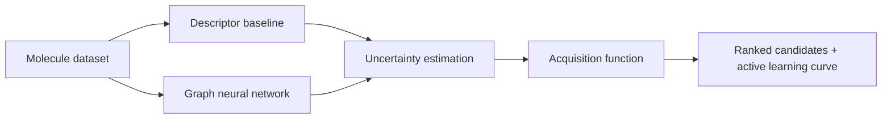

**The question:** given a limited experimental budget, which molecule should you measure
next?

**What you'd own:** composition-only vs. structure-aware representation; which uncertainty
method is calibrated enough to drive acquisition; exploration vs. exploitation in the
active-learning loop; whether your held-out split reflects real discovery or just
interpolation.

**Data + licence:** MoleculeNet / MatBench-style public benchmarks, generally permissive —
**confirm the specific set during the spike.**

**Compute:** low-medium. **Hardest unknown:** uncertainty calibration. An overconfident
model makes active learning worse than random sampling, which is a genuinely surprising
and demonstrable result.

## ClinicalScribe — clinical language understanding

**Industry:** Healthcare, clinical NLP
**Work mode:** Domain NLP, hallucination safety, de-identification
**Stack:** HuggingFace Transformers, medspaCy, Presidio for de-identification, pytest, FastAPI

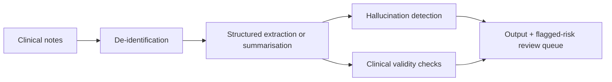

**The question:** can you detect when a clinical summary contains something the source
note never said?

Summarisation hallucination is a real, studied failure in clinical NLP, and it's the
barrier to deployment — which makes detecting it a more valuable contribution than
producing better summaries.

**What you'd own:** how to verify every statement traces to source text; what
de-identification is sufficient and how you'd test it; which errors are clinically
material vs. cosmetic; where a clinician must review regardless of confidence.

**Data + licence:** ⚠️ **Most rigorous access requirements on this list.** Clinical corpora
(MIMIC-family and similar) typically require credentialed access, a data use agreement,
and completed training before download. **Start this in week one of the spike or the
project can't begin.** Synthetic or openly-licensed clinical text is the fallback.

**Scope guardrail:** research and education only. **No diagnostic claims of any kind.**

**Compute:** medium. **Hardest unknown:** dataset access timing, ahead of any modelling
question.

---

# Privacy & Data

## SynthForge — synthetic data with a measured privacy tradeoff

**Industry:** Privacy engineering, regulated data
**Work mode:** Generative modelling, privacy attack testing
**Stack:** PyTorch, SDV, Opacus for DP-SGD, scikit-learn, FastAPI + React

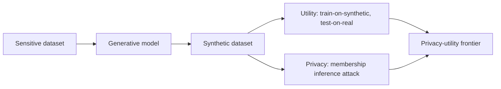

**The question:** how much utility do you lose to get a privacy guarantee that actually
holds up under attack?

This is the enabling technology for ML in regulated industries — where the real data
legally cannot leave the building — which makes it directly relevant to both finance and
healthcare.

**What you'd own:** which generative approach suits the data type; what privacy claim
you're actually making and whether it's formal or empirical; designing a membership
inference attack strong enough that surviving it means something; where on the
privacy-utility frontier a real deployment would sit.

**Why it resists hand-waving:** "it's synthetic so it's private" is a claim you can
**disprove with an attack**. Building the attack that breaks your own generator is the
most convincing thing on this list.

**Data + licence:** public tabular datasets standing in for sensitive ones — permissive
and easy to source.

**Compute:** low-medium. **Hardest unknown:** building an attack strong enough to be
meaningful. A weak attack that fails proves nothing.

---

# Wildcard

## NeuroTrace — neural path tracer

A path tracer where a neural network predicts where to spend compute. The most technically
differentiated thing considered — very few new grads can write a renderer *and* train a
model — and genuinely rare in a portfolio.

Held back rather than dropped because it's C++-heavy and has the largest scope. **If the
systems exercise in the taste-test is the one you enjoy most, ask about this** and we'll
look at whether a scoped V1 fits the timeline.

---

# What was cut, and why

Transparency on the curation, so you can push back if something looks wrong:

| Cut | Reason |
|---|---|
| ScanTrust (MRI reconstruction) | Your capstone already covers medical imaging + CV. `ClinicalScribe` covers healthcare from the language side instead, which is new ground for you. |
| DriveWorld, TrafficMind, GridPilot, SiliconPilot, ArenaMind | All reinforcement learning. `GripForge` represents the category; five variants would crowd out other sectors. |
| AgroScout | Overlaps `GeoSentinel` — both aerial imagery segmentation. |
| WeatherScale, MatForge (materials) | Overlap `FlowTwin` and `MolForge` respectively. |
| Generic RAG chatbots, summarisation apps, agent-swarm demos | Not for redundancy — because they're **easy to scaffold and show weak evidence of engineering judgment**. `EvalForge`, `AgentProof` and `CompliAgent` cover LLM work through its genuinely hard parts: measurement, reliability and verifiable grounding. |
| Frontend-led work | Your portfolio site already covers it. |

**One correction worth stating plainly.** An earlier version of this document cut all
LLM/RAG/agent projects on the grounds that Erseno already proved that skill. That was
wrong: the public Erseno repo is currently a scaffold — a handful of commits, config
files and an empty app directory — so an employer clicking it sees nothing.

Your experience may well be real, but **the evidence isn't public yet**, and the rule this
whole program runs on is that no claim counts without evidence behind it. That's why the
LLM projects are back on the list, and it's worth applying the same test to everything
else on your resume.
